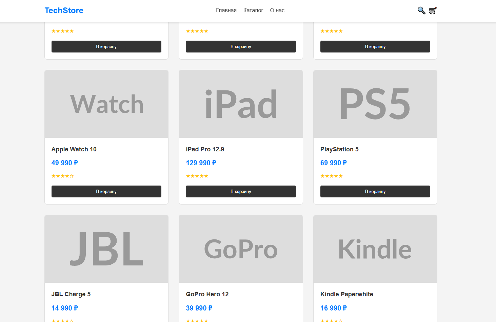
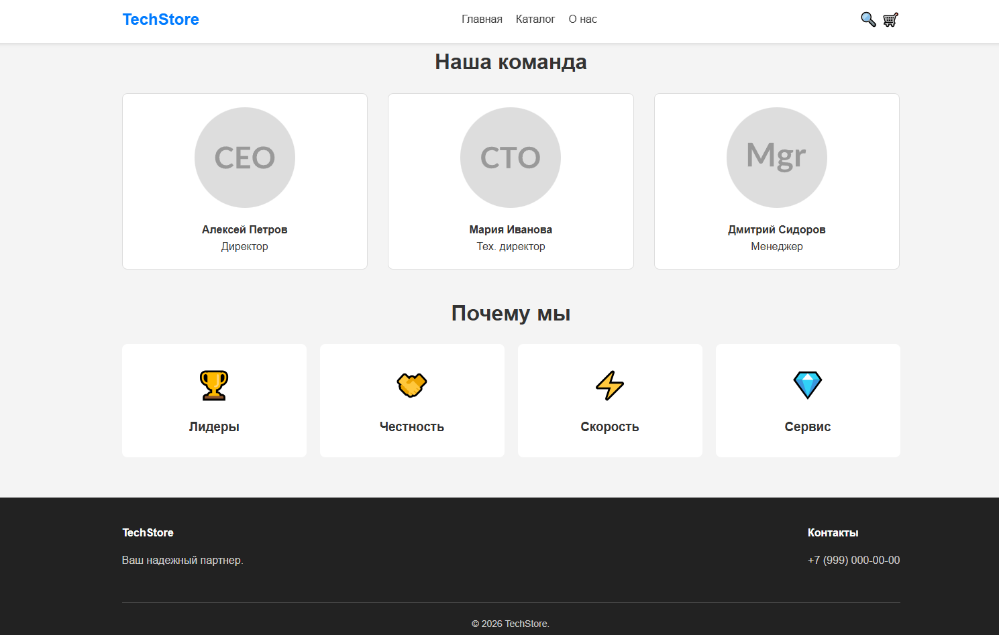

# Лабораторная работа №14-16 - Интернет-магазин "TechStore"

**ФИО:** Тотьмянин Тихон Алексеевич  
**Группа:** ИСП-232  
**Дата:** 20.02.2026

## Описание проекта
Многостраничный сайт интернет-магазина электроники "TechStore" с адаптивной вёрсткой.

## Реализованные страницы
- **Главная** — баннер, популярные товары, преимущества.
- **Каталог** — сетка из 9 карточек товаров.
- **О нас** — информация о магазине и команде.

## Реализованные функции
- Адаптивное меню.
- Карточки товаров с hover-эффектами.
- CSS Grid для каталога.
- Flexbox для навигации и футера.
- Адаптивная вёрстка.

## Технологии
- HTML5
- CSS3 (Flexbox, Grid, Media Queries)
- Git/GitHub

## Скриншоты

